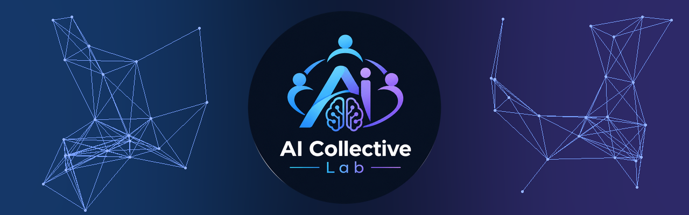

  

<h3 align="center">An independent research collective: AI & ML projects built together, from research experiments to deep learning systems.</h3>

  

---

## 🧠 Projects

| Project | What it is | Stack | Team |
|---|---|---|---|
| [LatentGAT](https://github.com/AI-Collective-Lab/latentgat-training-dashboard) · [research pages](https://ai-collective-lab.github.io/latentgat-training-dashboard/) | Brain tumour segmentation: a 3D U-Net with a graph-attention bottleneck, tested on three unseen cohorts | PyTorch · HTML | [@Muhammad-Azeem-Bhatti](https://github.com/Muhammad-Azeem-Bhatti) |
| [HIGGS ML Classification](https://github.com/AI-Collective-Lab/HIGGS-ML-Classification) | Logistic regression vs. a neural network on the 11M-event HIGGS dataset, with a data-scaling study | Python · Jupyter | [@Muhammad-Azeem-Bhatti](https://github.com/Muhammad-Azeem-Bhatti) · [@munahilamin03](https://github.com/munahilamin03) · [@zainulaabaidin](https://github.com/zainulaabaidin) |
| [Effectiveness of Balancing Dataset on Classification](https://github.com/AI-Collective-Lab/Effectiveness-Of-Balancing-Dataset-On-Classification) | Measures how balancing a dataset affects classification performance | Python · Jupyter | [@Muhammad-Azeem-Bhatti](https://github.com/Muhammad-Azeem-Bhatti) · [@munahilamin03](https://github.com/munahilamin03) · [@zainulaabaidin](https://github.com/zainulaabaidin) · [@Sumer238](https://github.com/Sumer238) |

## 📄 Ongoing research

Two manuscripts currently under submission. **All of our research is carried out under the supervision of Dr. Umme Zahoora.** Results are from the submitted versions and may change in review.

| Paper | Status | Authors | Key results |
|---|---|---|---|
| **Multi-Objective Selection of Hybrid Deep–Radiomic Features for Brain Tumor MRI Classification with Transparent Fuzzy Rule-Based Inference** A three-objective search (an opposition-based Harris Hawks extension of NSGA-II) cuts 2,420 hybrid deep + radiomic features to 25; a neuro-fuzzy ANFIS classifier then explains each decision with readable if–then rules. | 📨 Submitted · *Information Fusion* (Elsevier) · Aug 2026 | **[Muhammad Azeem Bhatti](https://github.com/Muhammad-Azeem-Bhatti)**, Khadija Tul Kubra, Umme Zahoora, Tanja Pavleska, Asifullah Khan | Accuracy 94.45% · macro F1 0.938 · 25 of 2,420 features |
| **A Privacy-Preserving Federated Learning Framework with Variance-Based Aggregation and Customized U-Net for Brain Tumor Segmentation** Trains a lightweight attention U-Net across hospitals without moving any scans; a new aggregation method, Fed-PLM, merges site updates along their direction of greatest variation. | 📨 Submitted · *Frontiers* | **[Sumer Iqbal](https://github.com/Sumer238)**, Khadija Tul Kubra, **[Muhammad Azeem Bhatti](https://github.com/Muhammad-Azeem-Bhatti)**, Farquleet Farhat Gondal, Saddam Hussain Khan, Umme Zahoora | Whole-tumour Dice 0.885 federated vs 0.894 centralised (BraTS 2021) |

## 💼 Industry work: internship at Golden Gate Innovations

Projects [@Muhammad-Azeem-Bhatti](https://github.com/Muhammad-Azeem-Bhatti) has built as an intern at **Golden Gate Innovations**: two delivered, one in progress. The code and data belong to Golden Gate Innovations, so only a summary of each is shown here.

| Project | What it does | Status | Built by |
|---|---|---|---|
| **K-Electric meter reading** | Reads electricity meters from field photos: finds the display, straightens it and reads the digits several times; agreeing reads are accepted automatically, the rest go to a person | 🟡 In progress | [@Muhammad-Azeem-Bhatti](https://github.com/Muhammad-Azeem-Bhatti) |
| **Urdu-English meeting transcription** | Transcribes meetings that switch between Urdu and English mid-sentence, then writes a summary with action items; audio never leaves the company's own servers | 🟢 Delivered | [@Muhammad-Azeem-Bhatti](https://github.com/Muhammad-Azeem-Bhatti) |
| **OSINT news monitor** | Collects public news, Reddit threads and government press releases; an LLM tags each item by topic and stance for analysts to review | 🟢 Delivered | [@Muhammad-Azeem-Bhatti](https://github.com/Muhammad-Azeem-Bhatti) |

## 🤝 Contributing

Each project has its own team. Open an issue in the project's repository to get involved.
